# 🔍 DigitalForensicsWebApp-React-Flask

**DigitalForensicsWebApp** is a web application built with **React** and **Flask**, designed for collecting and analyzing forensic data from a system. It extracts information about the system, users, files, attacks, and logs, with a focus on **network traffic analysis** and detecting **suspicious IP addresses**. The data is displayed in an intuitive **dashboard** and can be exported as a **PDF** for further investigation.

## 🛠 Technologies Used
- **Python** with libraries: `requests`, `subprocess`, `platform`, `os`, `pwd`, `stat`, `json`, `socket`, `datetime`, `psutil`, `hashlib`, `re`, `gzip`
- **JavaScript**
- **CSS**
- **Flask**
- **SQLAlchemy**
- **SQLite**
- **React**
- **Chart.js**
- **jsPDF**
- **Lottie**
- **John the Ripper**
- **LOKI**
- **tcpdump**
- **iptables**
- **VMware Workstation**
- **Kali Linux**
- **Ubuntu**
- **DVWA**
- **2 External APIs** (AbuseIPDB, ipinfo.io)

## 🚀 Functionalities
- Collects comprehensive forensic data from the system (hardware, software, users, files)
- Monitors and logs suspicious activities including SSH and web attacks
- Captures and analyzes network traffic, identifying suspicious IPs and DNS queries
- Integrates external APIs for enhanced IP reputation checks
- Displays data in an interactive React dashboard
- Exports customizable forensic reports as PDFs

## 🚀 Running the Application

### 1. Run the data collection script
Open a terminal and run the Python script that collects forensics data:

```bash
cd forensic_script
python collect_data.py
```

### 2. Start the backend server
```bash
cd server
python server.py
```

### 3. Start the frontend client
```bash
cd client
npm start
```

## 🖼️ Application Preview

### 🧑‍💻 About App
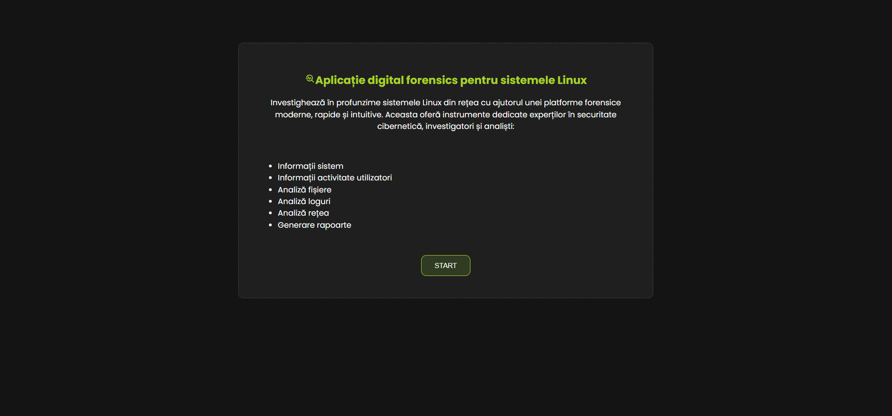

### 🖥️ Systems
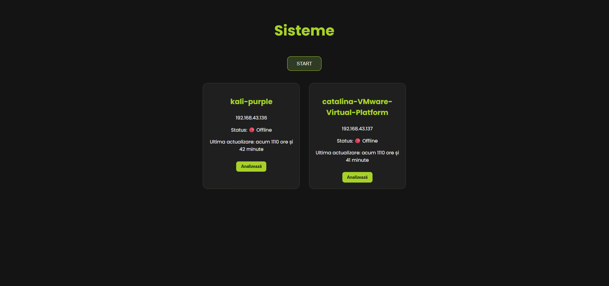

### 🎞️ Animation
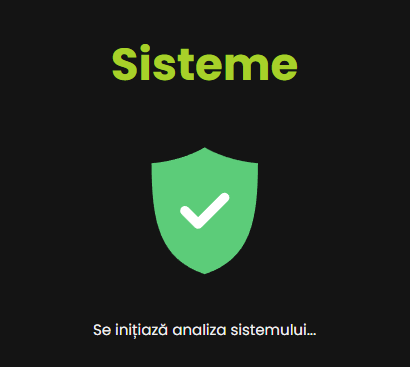

### 📊 Dashboard 
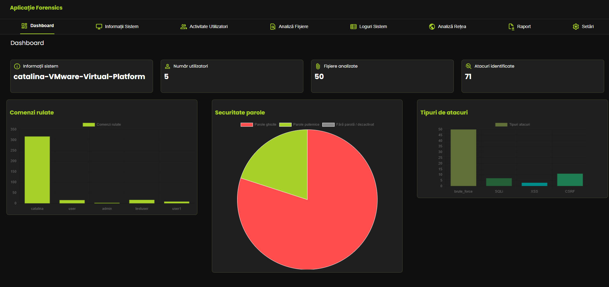

### 💻 System Info
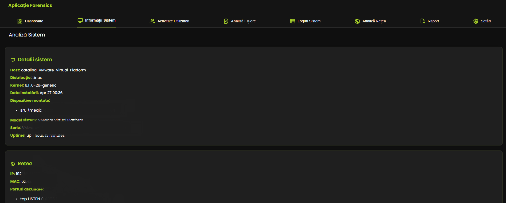
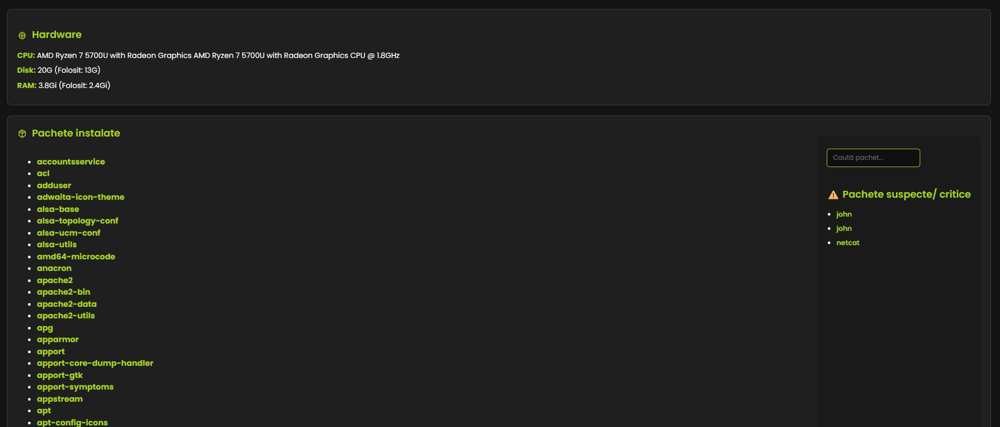

### 👤 Users Info
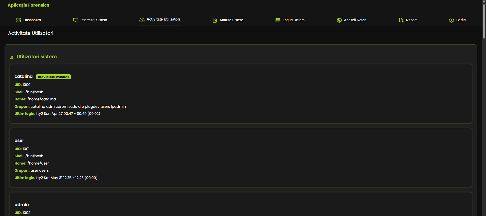
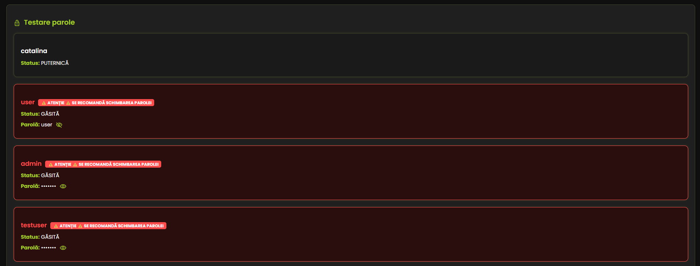
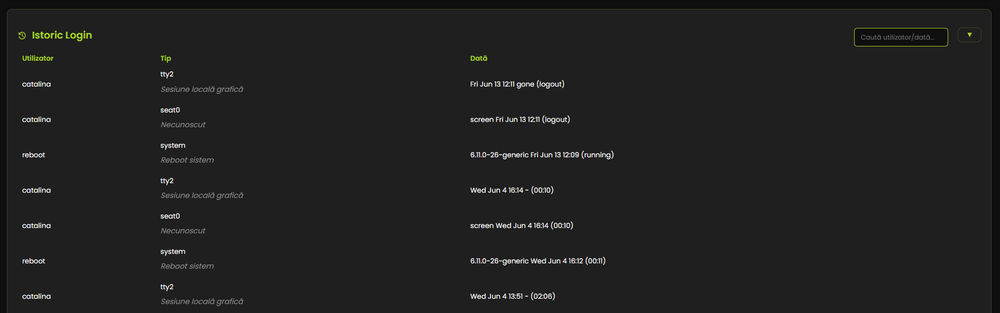
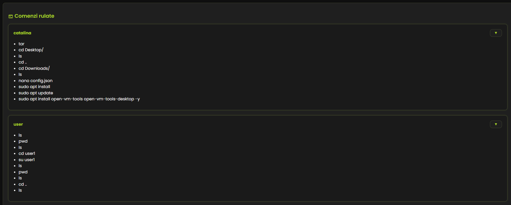

### 📁 Files
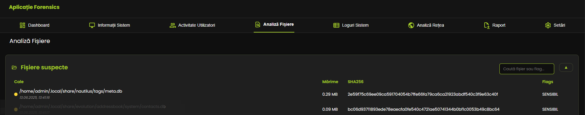

### 📜 Logs
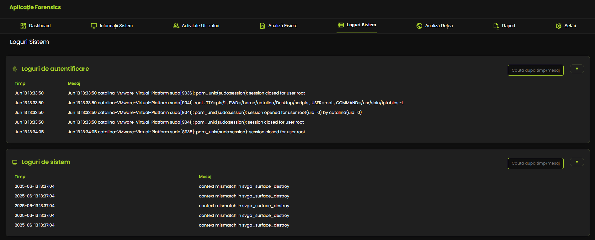
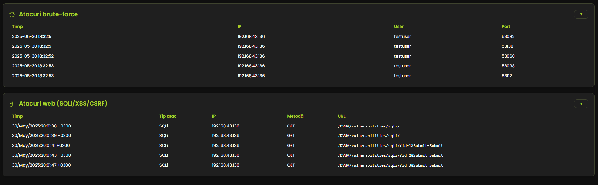

### 🌐 Networking
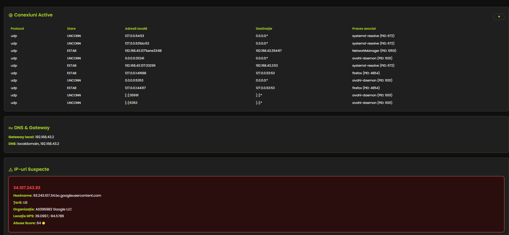

### 🧾 Report


### ⚙️ Settings
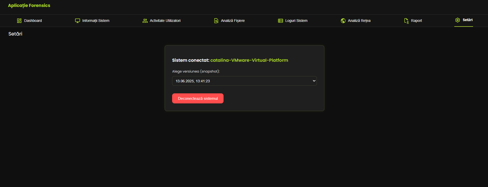


## 🚧 Future Improvements
- Develop an interactive bot to guide users through forensic data and answer common questions  
- Add functionality to compare system snapshots taken at different times for detecting changes and anomalies  
